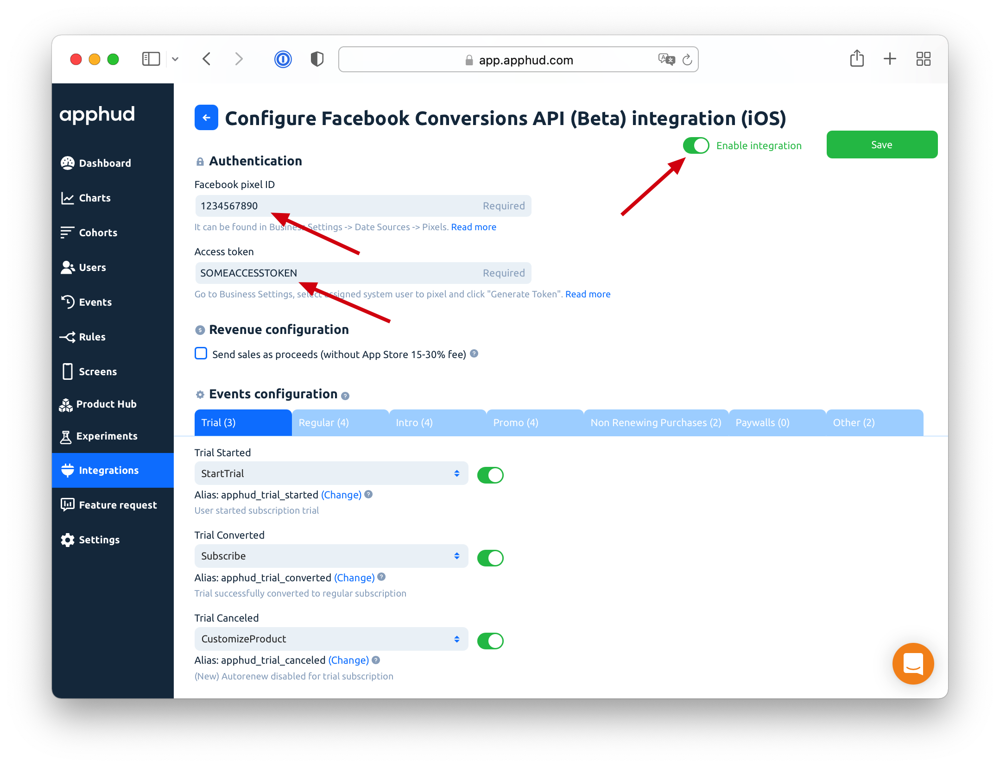

# Facebook Conversions API

The Conversions API allows advertisers to send web events from their servers directly to Facebook. Server events are linked to a pixel and are processed like browser pixel events. This means that server events are used in measurement, reporting, and optimization in the same way as browser pixel events. Your in-app purchase events including subscription renewals will be sent to Facebook as web events.

## Using Conversions API for Web-to-App campaign optimization

Conversions API is useful when running **Web-to-App** (or Web2App) campaigns in Facebook with event optimization. [Learn more](https://blog.apphud.com/web-to-app-facebook-conversions-api/).

> Web-to-App campaign is a web campaign targeted to your app’s landing page which has a link to the App Store.

## Getting Started

Integration is a part of Web-to-App solution. Please follow [this](../../web-to-app/introduction.md#step-by-step-guide) link for details.

## Requirements

1. [Verified](https://developers.facebook.com/docs/sharing/domain-verification/) domain for your landing page.
2. Create [Facebook Pixel](https://business.facebook.com/settings/pixels).
3. Generate [Access Token](facebook-conversions-api.md#generating-access-token) for your pixel.
4. [Configure](https://www.facebook.com/business/help/422408905612648?id=1877298665783613) and prioritize events in Events Manager of your pixel. **Only prioritized events** can be used for advertising. The most valuable event, like purchase event, should always have the highest priority.

## How to add integration?



* In Business settings create [Facebook Pixel](https://business.facebook.com/settings/pixels) if you don't have it yet.
* [Generate Access Token](facebook-conversions-api.md#generating-access-token) for your Pixel.



* Go to Apphud integrations page and select Facebook Conversions API.

.png>)



* Insert Pixel ID and Access Token that you got in previous steps.
* Edit your events configuration by disabling unnecessary ones or changing event names.
* Click on **Enable integration** and **Save**.




[Install a script](../../web-to-app/script-install.md#facebook) if you use your own landing page. Or create one using [Landing Page Editor](../../web-to-app/landing-page-editor.md).

For more information visit [this](../../web-to-app/introduction.md#step-by-step-guide) link.



## Generating Access Token

There are two ways of getting your access token:

* Via Events Manager (recommended)
* Via System Use

### Via Events Manager (recommended)

* Go to settings of your pixel in Events Manager.
* Under **settings** tab, find **Set up manually** section.
* Use **Generate access token** button to generate your token.


The Generate access token link is only visible to users with developer privileges for the business. The link is hidden from other users.


### Via System User


Generating access token via system user works only if your Business owns the app.


* Go to your Business' **Settings**.
* Under **System users** tab, create your system user with Employee access, if you don't have it yet.
* Assign a pixel to your system user.
* Click **Generate token**.


You do not need to request any permissions or pass App Review .


For more information follow this [link](https://developers.facebook.com/docs/marketing-api/conversions-api/get-started#access-token).

## Additional parameters

You can add custom parameters, like email or date of birth, in order to increase match quality.

Here is a list of acceptable additional optional parameters that you can send from Apphud SDK via user properties method:

| `email`       | Email of the user                                                                                                  | `Apphud.setUserProperty(key: .email, value: "user@example.com", setOnce: true)` |
| ------------- | ------------------------------------------------------------------------------------------------------------------ | ------------------------------------------------------------------------------- |
| `gender`      | `male` or `female`. **Note**: valid only if first name or last name provided.                                      | `Apphud.setUserProperty(key: .gender, value: "male", setOnce: true)`            |
| `fb_login_id` | The ID issued by Facebook when a person first logs into an instance of an app. This is also known as App-Scoped ID | `Apphud.setUserProperty(key: .init("fb_login_id"), value: "someID")`            |
| `birthdate`   | Date of birth in `YYYYMMDD` format, example: 19970216                                                              | `Apphud.setUserProperty(key: .init("birthdate"), value: "19970216")`            |
| `first_name`  | First name of the user. **Note**: valid only if gender provided.                                                   | `Apphud.setUserProperty(key: .init("first_name"), value: "Thomas")`             |
| `last_name`   | Last name of the user. **Note**: valid only if gender provided.                                                    | `Apphud.setUserProperty(key: .init("last_name"), value: "Anderson"`             |

For more information about customer parameters visit [this](https://developers.facebook.com/docs/marketing-api/conversions-api/best-practices#baseline-requirements-for-matching) link.

## Receive Attribution Data

In order to get attribution data from Facebook web campaigns, you will need add URL parameters to understand where visitors are coming from.

Paste these parameters to **URL parameters** field in **Tracking** section of your **ad** set up page.

`campaign_name={{campaign.name}}&adset_name={{adset.name}}&ad_name={{ad.name}}&network=facebook`

More information about URL parameters for attribution can be found [here](https://www.facebook.com/business/help/2360940870872492) and [here](https://www.facebook.com/business/help/1016122818401732).

## Analyze Facebook campaigns in Apphud

Since integration is a part of Web-to-App solution, analytics is described in [this](../../web-to-app/ad-analytics.md) guide.

## Troubleshooting

Please double check the following list in case you experience issues with integration. Make sure the following is correct:

* Your landing page should contain correct script code. Double check [this](../../web-to-app/script-install.md) guide.
* Events should be correctly prioritized in Web Events Configuration page in Events Manager. The most valuable event, like purchase event, should have the highest priority.
* Only prioritized events can be used for advertising.
* Prioritized events should be correctly mapped with Apphud events in integration settings page. For example, `Subscription Started` event should be mapped either with `purchase` or `subscribe` event. It's up to developer to choose desired mapping.
* Keep in mind that whenever a customer takes multiple actions during a conversion window, only the highest priority event is recorded.
* Double check that System User has your pixel as assigned asset.
* Read Facebook's useful docs: [https://www.facebook.com/business/help/422408905612648](https://www.facebook.com/business/help/422408905612648?id=1877298665783613), [https://www.facebook.com/business/help/721422165168355](https://www.facebook.com/business/help/721422165168355?id=1877298665783613), [https://www.facebook.com/business/help/223073145946545](https://www.facebook.com/business/help/223073145946545?id=1877298665783613)
* Still having troubles? [Contact](https://apphud.com/contact) us.

## Useful Tips

* You may experience low install or purchase rate when running Web-to-App campaign with Purchase event optimization. Consider targeting for less priority events at the beginning, like `User Created` , `Paywall Shown` or `Paywall Checkout Initiated`. You can view and edit event mapping in Facebook Conversions API integration page.

.png>)

###
